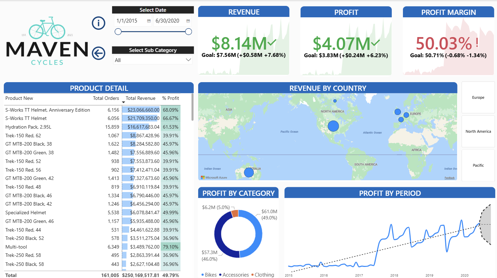
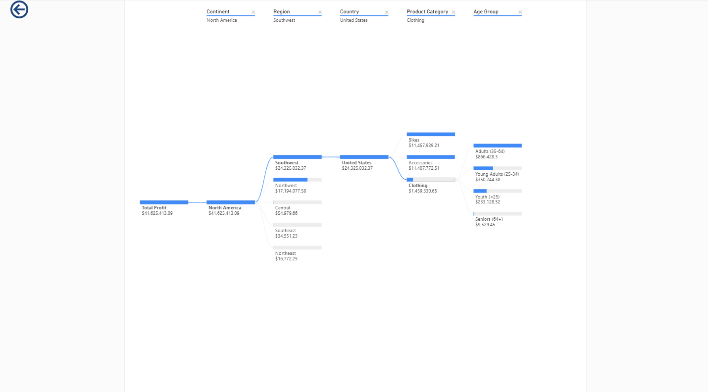
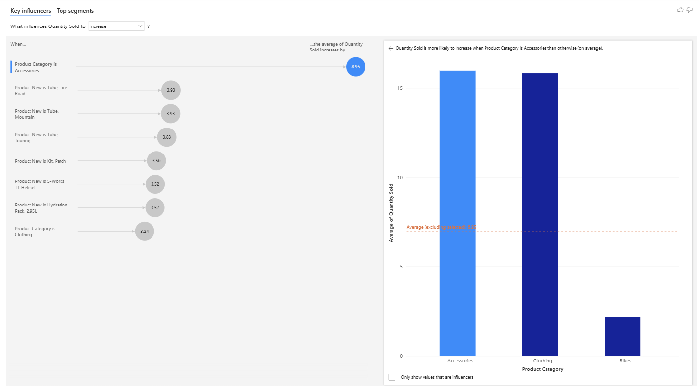

# 🚲 Maven Cycles — Sales & Profitability Analytics

Interactive Power BI project designed to analyze sales performance, profitability, product performance, geographic trends, and key business drivers.

## 📊 Project Overview

This project analyzes Maven Cycles sales data through an interactive Power BI solution designed to provide an executive view of business performance.

The dashboard enables users to monitor key performance indicators, explore profitability across products and geographic markets, analyze performance over time, and investigate the factors driving business results.

## 🎯 Business Questions

The analysis was designed to answer questions such as:

- How are revenue and profit performing against business targets?
- Which products and product categories generate the most revenue and profit?
- How does performance vary across countries and regions?
- How has profitability changed over time?
- Which customer and product characteristics are associated with changes in sales performance?

## 🛠️ Tools & Skills

- **Power BI** — Dashboard development and interactive data visualization
- **Power Query** — Data cleaning and transformation
- **DAX** — Measures, KPIs, and analytical calculations
- **Data Modeling** — Relationships between fact and dimension tables
- **Decomposition Tree** — Drill-down and performance driver analysis
- **Key Influencers** — Identification of factors associated with changes in sales performance

## 🗂️ Data Model

The analytical model connects sales data with multiple business dimensions, including:

- Products
- Product categories and subcategories
- Calendar
- Customer demographics
- Geographic regions

The model uses relationships between fact and dimension tables to support dynamic filtering and analysis across multiple business perspectives.

## 📈 Dashboard Analysis

### Executive View

The executive dashboard provides a consolidated view of:

- Revenue
- Profit
- Profit Margin
- Performance against targets
- Product-level performance
- Revenue by country
- Profit by category
- Profit trends over time

### Decomposition Tree

A Decomposition Tree was implemented to analyze **Total Profit** across multiple dimensions, including continent, region, country, product category, and customer age group.

### Key Influencers

The Key Influencers visual was used to explore which product characteristics are associated with increases in **Quantity Sold**, providing an additional layer of exploratory analysis beyond traditional dashboard reporting.

## 💡 Key Insights

- Revenue reached **$8.14M**, exceeding the $7.56M target by approximately **7.7%**.
- Profit reached **$4.07M**, exceeding the $3.83M target by approximately **6.2%**.
- Profit margin was **50.03%**, slightly below the 50.71% target.
- Profitability varies significantly across product categories, geographic markets, and customer segments.
- The analytical views allow users to investigate the underlying factors contributing to changes in business performance.

## 📁 Project File

The complete Power BI report is available in this repository:

`Maven-Cycles-Sales-Analytics.pbix`

## 👤 Author

**Juan Alejandro Bencosme Diaz**  
Data Analyst | Power BI | Python | Data Visualization
